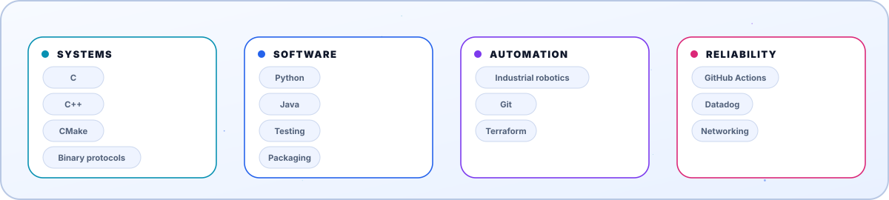

<picture>
  <source media="(prefers-color-scheme: dark)" srcset="assets/profile-hero-dark.svg" />
  <source media="(prefers-color-scheme: light)" srcset="assets/profile-hero-light.svg" />
  
</picture>

 

## Featured system

<picture>
  <source media="(prefers-color-scheme: dark)" srcset="assets/orbitops-feature-dark.svg" />
  <source media="(prefers-color-scheme: light)" srcset="assets/orbitops-feature-light.svg" />
  
</picture>

  <a href="https://github.com/DavCalo/OrbitOps"><strong>Explore OrbitOps</strong></a>
  &nbsp;·&nbsp;
  <a href="https://github.com/DavCalo/OrbitOps/blob/main/docs/architecture.md">Architecture</a>
  &nbsp;·&nbsp;
  <a href="https://github.com/DavCalo/OrbitOps#quick-start">Run the demo</a>

## Active missions

<table>
  <tr>
    <td width="50%" valign="top">
      

        
        &nbsp;&nbsp;<strong>AlbaSat UniPD</strong>
      

      
CubeSat · embedded software

      
Developing embedded software for a multidisciplinary university CubeSat mission.

    </td>
    <td width="50%" valign="top">
      

        <picture>
          <source media="(prefers-color-scheme: dark)" srcset="assets/mip-logo-dark.png" />
          <source media="(prefers-color-scheme: light)" srcset="assets/mip-logo-light.png" />
          
        </picture>
        &nbsp;&nbsp;<strong><a href="https://www.miptechnologies.tech">MIP Technologies</a></strong>
      

      
AI · software development

      
Building AI-powered applications and tailored software systems.

    </td>
  </tr>
</table>

## Contribution constellation

  <picture>
    <source media="(prefers-color-scheme: dark)" srcset="https://raw.githubusercontent.com/DavCalo/DavCalo/output/contribution-scan-dark.svg" />
    <source media="(prefers-color-scheme: light)" srcset="https://raw.githubusercontent.com/DavCalo/DavCalo/output/contribution-scan.svg" />
    
  </picture>

  
    Generated from live GitHub data with
    <a href="scripts/generate_contribution_scan.py">Python</a>, GraphQL, SVG, and GitHub Actions.
  

## Engineering stack

<picture>
  <source media="(prefers-color-scheme: dark)" srcset="assets/engineering-stack-dark.svg" />
  <source media="(prefers-color-scheme: light)" srcset="assets/engineering-stack-light.svg" />
  
</picture>

---

### Build beyond the screen.

Embedded software · telemetry · automation · systems that interact with the physical world

[LinkedIn](https://www.linkedin.com/in/davide-cal%C3%B2-632255390) · [Email](mailto:calo.davide02@gmail.com)

