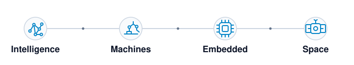

# Davide Calò

**Engineering software where intelligence meets machines, embedded systems, and space.**

  
  

  <picture>
    <source
      media="(prefers-color-scheme: dark)"
      srcset="https://raw.githubusercontent.com/DavCalo/DavCalo/output/contribution-scan-dark.svg"
    />
    <source
      media="(prefers-color-scheme: light)"
      srcset="https://raw.githubusercontent.com/DavCalo/DavCalo/output/contribution-scan.svg"
    />
    
  </picture>

  
    <strong>Signal Flare</strong> · A rolling 26-week view of my GitHub activity. 
    Active days flare as the satellite passes.
  

  
    Python · GraphQL · SVG · GitHub Actions ·
    <a href="scripts/generate_contribution_scan.py">Source</a> ·
    <a href=".github/workflows/contribution-scan.yml">Workflow</a>
  

I study Computer Engineering and build software that moves from algorithms into real systems—from AI and industrial automation to embedded platforms and space missions.

## Current work

  <picture>
    <source media="(prefers-color-scheme: dark)" srcset="assets/mip-logo-dark.png" />
    <source media="(prefers-color-scheme: light)" srcset="assets/mip-logo-light.png" />
    
  </picture>
  &nbsp;&nbsp;<strong><a href="https://www.miptechnologies.tech">MIP Technologies</a></strong>
  · AI &amp; Software Development 
  Building AI-powered software and tailored digital systems.

  
  &nbsp;&nbsp;<strong>AlbaSat UniPD</strong>
  · University CubeSat Project 
  Developing embedded software for a multidisciplinary CubeSat mission.

## From intelligence to orbit

  <picture>
    <source media="(prefers-color-scheme: dark)" srcset="assets/systems-ribbon-dark.svg" />
    <source media="(prefers-color-scheme: light)" srcset="assets/systems-ribbon-light.svg" />
    
  </picture>

  Software carries ideas from intelligent applications into machines, embedded platforms, and space systems.

## Engineering toolkit

  <strong>Languages</strong> 
  <code>C</code> <code>C++</code> <code>Java</code> <code>Python</code> <code>SQL</code>

  <strong>Industrial robotics</strong> 
  <code>KUKA / KRL</code> <code>Comau / PDL2</code> <code>Epson / SPEL+</code>

  <strong>Observability &amp; infrastructure</strong> 
  <code>Git</code> <code>GitHub Actions</code> <code>Terraform</code> <code>Datadog</code>

---

**Let's build systems that move beyond the screen.**

Open to exchanging ideas and collaborating on intelligent software, automation, embedded engineering, and space systems.

