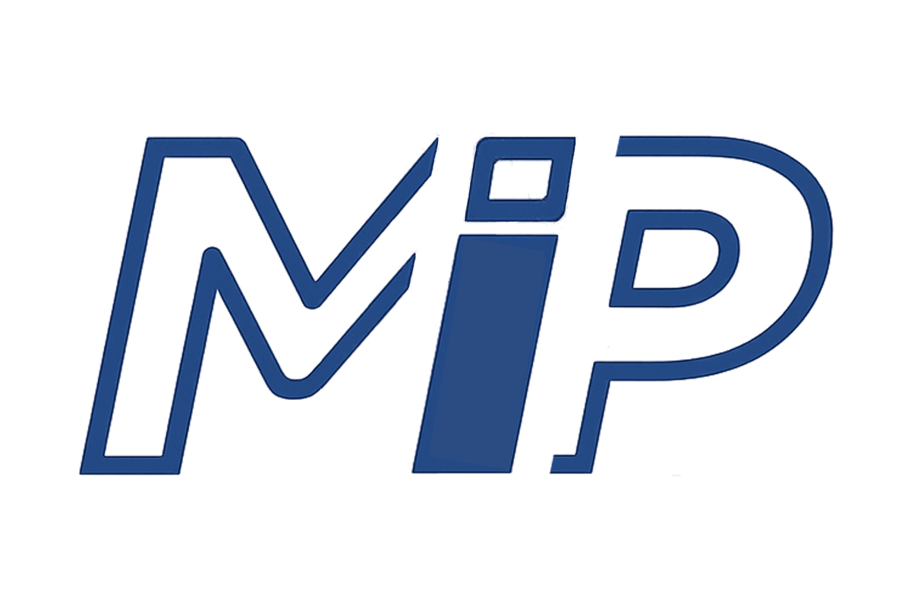
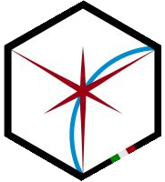
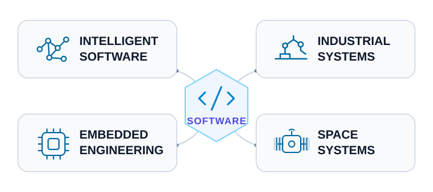

# Davide Calò

**Engineering software where intelligence meets machines, embedded systems, and space.**

  
  

  <picture>
    <source
      media="(prefers-color-scheme: dark)"
      srcset="https://raw.githubusercontent.com/DavCalo/DavCalo/output/contribution-scan-dark.svg"
    />
    <source
      media="(prefers-color-scheme: light)"
      srcset="https://raw.githubusercontent.com/DavCalo/DavCalo/output/contribution-scan.svg"
    />
    
  </picture>

  
    <strong>Signal Flare</strong> · A rolling 26-week view of my GitHub activity. 
    Active days flare as the satellite passes.
  

  
    Python · GraphQL · SVG · GitHub Actions ·
    <a href="scripts/generate_contribution_scan.py">Source</a> ·
    <a href=".github/workflows/contribution-scan.yml">Workflow</a>
  

I study Computer Engineering and build software across the boundary between algorithms and the physical world—from AI and industrial automation to embedded and space systems.

## Current missions

<table width="100%">
  <tr>
    <td width="50%" align="center" valign="top">
      

        <picture>
          <source
            media="(prefers-color-scheme: dark)"
            srcset="assets/mip-logo-dark.png"
          />
          <source
            media="(prefers-color-scheme: light)"
            srcset="assets/mip-logo-light.png"
          />
          
        </picture>
      

      <strong><a href="https://www.miptechnologies.tech">MIP Technologies</a></strong> 
      AI &amp; Software Development
      
AI-powered software and tailored digital solutions.

    </td>
    <td width="50%" align="center" valign="top">
      

        
      

      <strong>AlbaSat UniPD</strong> 
      University CubeSat Project
      
Software and embedded systems for a university CubeSat mission.

    </td>
  </tr>
</table>

## Engineering systems map

  <picture>
    <source
      media="(prefers-color-scheme: dark)"
      srcset="assets/engineering-systems-dark.svg"
    />
    <source
      media="(prefers-color-scheme: light)"
      srcset="assets/engineering-systems-light.svg"
    />
    
  </picture>

  Software as the connective layer across AI, 6-axis robotics, embedded engineering, and CubeSat systems

## Engineering toolkit

  <strong>Languages</strong> 
  
  
  
  
  

  <strong>Industrial robotics</strong> 
  
  
  

  <strong>Tools &amp; platforms</strong> 
  
  
  

  <strong>Systems &amp; domains</strong> 
  Machine vision · AI-powered software · Embedded systems · Low-level programming · CubeSat systems

---

**Let's build software that moves beyond the screen.**

Open to exchanging ideas and collaborating on software, automation, embedded systems, and space-oriented projects.

