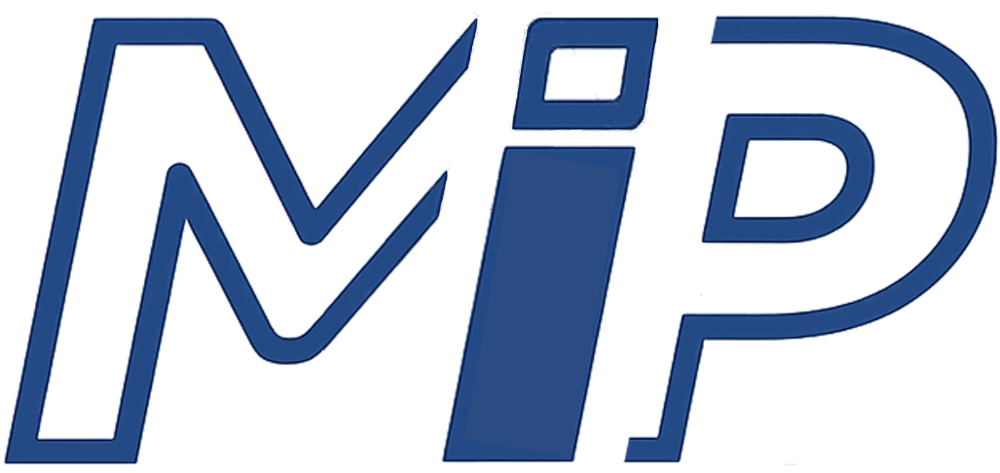
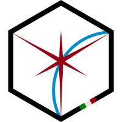

# Hi, I'm Davide Calò 👋

### I build things that think — and sometimes fly. 🛰️

Computer Engineering student exploring the space between  
**AI**, **embedded software**, and **space technology**.

  
  
  

---

## 🌌 A little about me

I enjoy turning ideas into software and learning what happens when code meets the real world.

Right now, I am:

- 🎓 studying **Computer Engineering**
- 🤖 contributing to software development at **MIP Technologies Ltd.**
- 🛰️ taking part in the **AlbaSat** university CubeSat project
- ⚙️ improving my skills in **C, C++, Java, Python, SQL**, and software design
- 🚀 exploring how intelligent software can work inside embedded and space systems

> When I am not debugging, I am probably thinking about how software can leave Earth.

## 🚀 Where I'm building

<table>
<tr>
<td width="50%" valign="top">

###  MIP Technologies

**AI & Software Development**

Learning and contributing in an AI-focused environment involving intelligent software, automation, and practical applications of artificial intelligence.

<a href="https://www.miptechnologies.tech"><strong>Visit the website →</strong></a>

</td>
<td width="50%" valign="top">

###  AlbaSat

**University CubeSat Project**

Contributing to a multidisciplinary project where software, embedded systems, electronics, and space technology come together.

</td>
</tr>
</table>

## 🧰 My toolbox

  
  
  
  
  
  

## 🔭 Currently on my radar

  
  
  
  

- building small projects that teach me something real
- writing cleaner and more maintainable code
- connecting software engineering with physical systems
- documenting what I learn along the way

## 🛰️ Contribution scan

One satellite pass scans a full year of GitHub activity from left to right. Each signal represents a day: its position shows the date and weekday, while its brightness shows the number of contributions.

  <picture>
    <source
      media="(prefers-color-scheme: dark)"
      srcset="https://raw.githubusercontent.com/DavCalo/DavCalo/output/contribution-scan-dark.svg"
    />
    <source
      media="(prefers-color-scheme: light)"
      srcset="https://raw.githubusercontent.com/DavCalo/DavCalo/output/contribution-scan.svg"
    />
    
  </picture>

## ✨ What you'll find here

A growing collection of university work, experiments, and personal projects involving software engineering, intelligent systems, and space-oriented technology.

I am still learning — and that is exactly why I build in public.

---

### 📡 Let's connect

I am always happy to meet curious people, exchange ideas, and collaborate on meaningful projects.

**Build. Learn. Launch. Repeat. 🚀**

